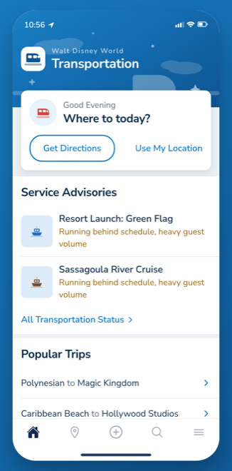
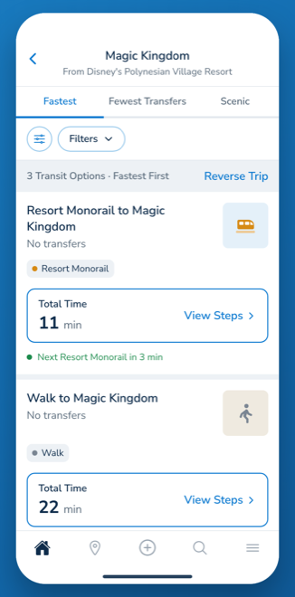
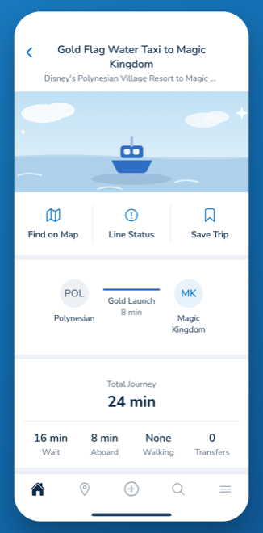
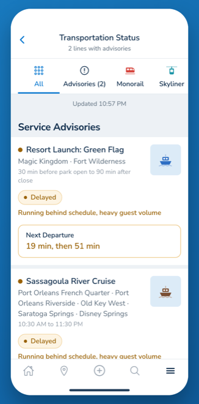

# Walt Disney World Transportation

Pick where you are and where you're going, and it tells you how to get there on Disney transport: monorails, the Skyliner, boats and buses.

**Live demo: [disney-transport-app.vercel.app](https://disney-transport-app.vercel.app)**

Built with Expo and React Native in TypeScript, so the same code runs on iOS, Android and in a browser.

| Pick two places | Every way to get there, ranked | Where the time actually goes |
|:--:|:--:|:--:|
|  |  |  |

## What it does

You pick two places out of 33: every park, every resort, both water parks, Disney Springs. It lays out the ways to get between them. Around 350 routes are written out by hand, and where two places have no direct link it builds a trip through a transfer point instead.

Trips are ranked by how long the whole thing takes, not just the time you're on the vehicle. That means counting the wait. A bus every 20 minutes costs you about 10 minutes of standing there, and a trip that ignores that isn't telling you the truth. The detail page splits the total back out into wait, ride and walking so you can see where the time goes.

Some things only run at certain hours. Park-to-park buses don't start until 10am, the Blue Flag boat starts at 3pm, and Disney Springs buses from the parks start at 4pm. The planner checks the clock and shows the all-day options alongside the restricted ones, labeling which is which.

That "instead" is a search rather than a lookup, which matters more than it sounds. Anywhere can be a transfer point if something leaves it for where you're going, and the way in is compared across every mode that gets you there. So leaving Magic Kingdom before 10am, you're told about the monorail to the Contemporary *and* the eight-minute walk to it, because they cost the same.

The Express beam is modeled the way it actually runs: one way into Magic Kingdom through the morning, with the return leg opening around lunchtime at a slightly different time each day. That trip still appears before it opens, labeled with the hour it's expected, because "not yet, here's when" beats leaving it out.

And when a monorail beam goes down, Disney puts a bus on its stops, so the planner will route you onto it. It competes on the same cost model as everything else, which sorts itself out nicely: a nine-minute stoppage is still worth waiting out and the beam keeps its place, while a forty-five minute one isn't, and the bus moves above it.

There's also a status board for every line and a pannable map with live departures on it.

## Offline

All the data is static: the route graph, the line definitions, and a status engine that computes from the clock. Nothing needs a network, which is the point: park wifi at 2pm is not a network. Add it to your home screen and it runs as an app.

## About the "live" data

Disney has no public transport API, so none of the status data is real. I made it up.

The first version used `Math.random()` on a timer, which had an obvious problem: refreshing rerolled everything. You could watch the Skyliner shut for lightning, hit reload, and it was running again. That doesn't read as variable, it reads as broken.

Now every line's status comes from the current time and nothing else, with no stored state and no `Math.random()` anywhere in the simulation. So reloading gives you the same board, everyone sees the same thing at the same time, and a test can freeze the clock and assert exactly what happens.

A few things fall out of that. Storms take out a whole group of boats at once rather than one at random while its neighbor keeps going, because the outage is decided per body of water. Monorail lightning starts with the EPCOT beam and can spread. And the Express beam's opening time is seeded on the date, so it holds all day and is different tomorrow.

<p align="center">
  <br>
  <em>The status board, computed from the clock</em>
</p>

## How it was built

I built this with Claude Code. The calls about how it should behave are mine: how trips get ranked, what counts as a fair comparison between two ways of getting somewhere, and which guarantees the tests have to hold. Claude did a lot of the typing.

## Running it

```
git clone https://github.com/austin5374/disney-transport-app.git
cd disney-transport-app
npm install --legacy-peer-deps

npx expo start --web    # opens in a browser
npx expo start          # scan the QR code with Expo Go
```

`--legacy-peer-deps` is needed because a few packages haven't caught up to React 19. It works fine, npm just complains. `./install.sh` does the same install and prints the same next steps, if you would rather run one thing.

## Tests

```
npm test              # both suites
npm run test:logic    # the route graph and the status engine
npm run test:screens  # the real screens
npm run typecheck
```

Two suites, split by what they need to run. The logic suite runs under ts-jest with no native pipeline, so a sweep across all 1,056 destination pairs finishes in about a second. The screens suite renders the real screens under jest-expo.

Most of the route-data tests exist because the data was typed out by hand and I didn't trust it. Writing them turned up real problems, like five routes whose total didn't match the sum of their own legs.

The more useful ones are guarantees about the whole network, checked across every ordered pair:

- every pair has an answer that isn't a paid car
- no pair is offered a journey long enough to be a mistake
- every two stops on the same boat or Skyliner line are actually connected
- a paved path that walks one way walks the other way too
- a paid Minnie Van never outranks Disney transport

That last one is why the sweeps cover all 1,056 pairs rather than sampling. This kind of gap is never the pair you happen to check by hand.

## Files

```
src/
  screens/       the pages
  components/
    ui/          buttons, sections, tabs, dividers
  data/
    destinations.ts the 33 places you can pick
    routes.ts       hand-authored trips
    lines.ts        transit lines and their operating hours
    rail.ts         monorail pairs, derived from the beams
    lineRoutes.ts   boat and Skyliner pairs, derived from the stops
    resortBus.ts    resort buses, derived from Disney's own rule
  utils/
    routing.ts      works out trips and ranks them against live service
    liveStatus.ts   the simulated status engine
    theme.ts        colors, type sizes, spacing
  __tests__/
```

Three of those data files generate trips instead of listing them, which is deliberate. The monorail resort loop had only 12 of its 20 ordered pairs written out, so Magic Kingdom to Grand Floridian offered a walk and no train. The boats had the same latent bug, and so did the resort buses. Deriving trips from stops makes that whole class of gap impossible rather than fixing it one instance at a time.

## Sharing a trip

Every screen has a URL. `/trip/POLY/MK` is Polynesian to Magic Kingdom, `/trip/POLY/MK/:routeId` is one specific way of doing it, and `/more/status` is the board. A saved trip stores the question rather than the answer, so opening it re-checks against the day's service instead of handing back a route from last week.

## License

All rights reserved, and the [LICENSE](LICENSE) file means it. The code is here to be read, and to be run locally if you want to watch it work. It is not here to be reused or redistributed. If you want to use part of it, ask me first.

## Disclaimer

The route information is based on the real Walt Disney World transportation system. Everything about live service is simulated, as described above.

This is a personal project, not affiliated with or endorsed by Disney. Park and resort names are used so you know what the app is talking about.

---

Made by [Austin Vodrazka](https://github.com/austin5374) with [Claude Code](https://claude.com/claude-code).
